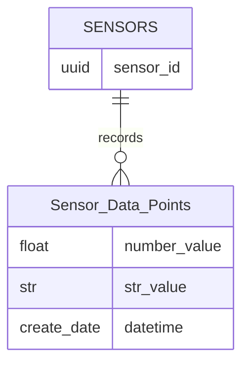

```mermaid

erDiagram
    SENSORS ||--o{ Sensor_Data_Points : records
    SENSORS {
        uuid sensor_id
        
    }
    
    Sensor_Data_Points {
        float number_value
        str str_value
        create_date datetime
    }
   


```

