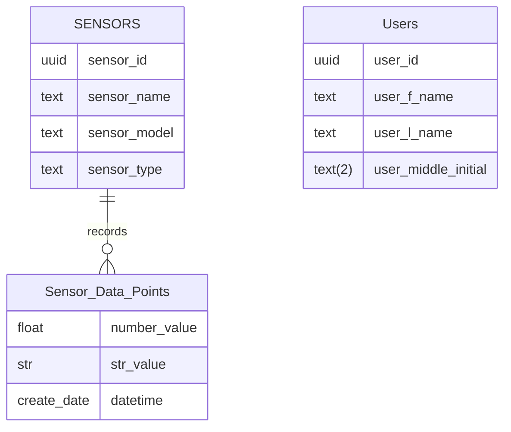

```mermaid

erDiagram
    SENSORS ||--o{ Sensor_Data_Points : records


    Users{
        uuid user_id
        text user_f_name
        text user_l_name
        text(2) user_middle_initial
    }


    SENSORS {
        uuid sensor_id
        text sensor_name 
        text sensor_model
        text sensor_type
        
    }
    
    Sensor_Data_Points {
        float number_value
        str str_value
        create_date datetime
    }
   


```

