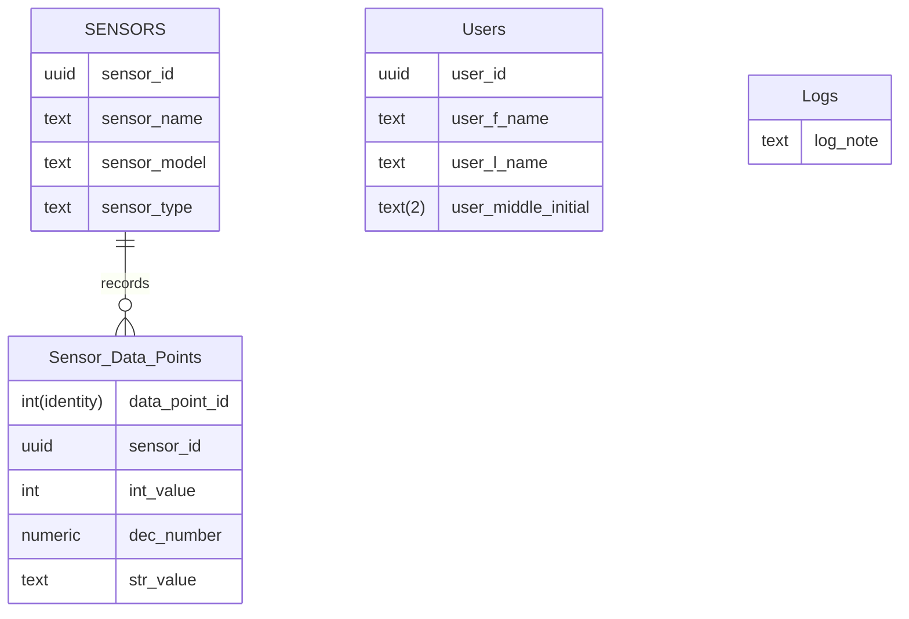

```mermaid

erDiagram
    SENSORS ||--o{ Sensor_Data_Points : records


    Users{
        uuid user_id
        text user_f_name
        text user_l_name
        text(2) user_middle_initial
    }


    SENSORS {
        uuid sensor_id
        text sensor_name 
        text sensor_model
        text sensor_type
        
    }
    
    Sensor_Data_Points {
        int(identity) data_point_id
        uuid sensor_id
        int int_value 
        numeric dec_number  
        text str_value
    }
   
    Logs{
        text log_note
    }


```

