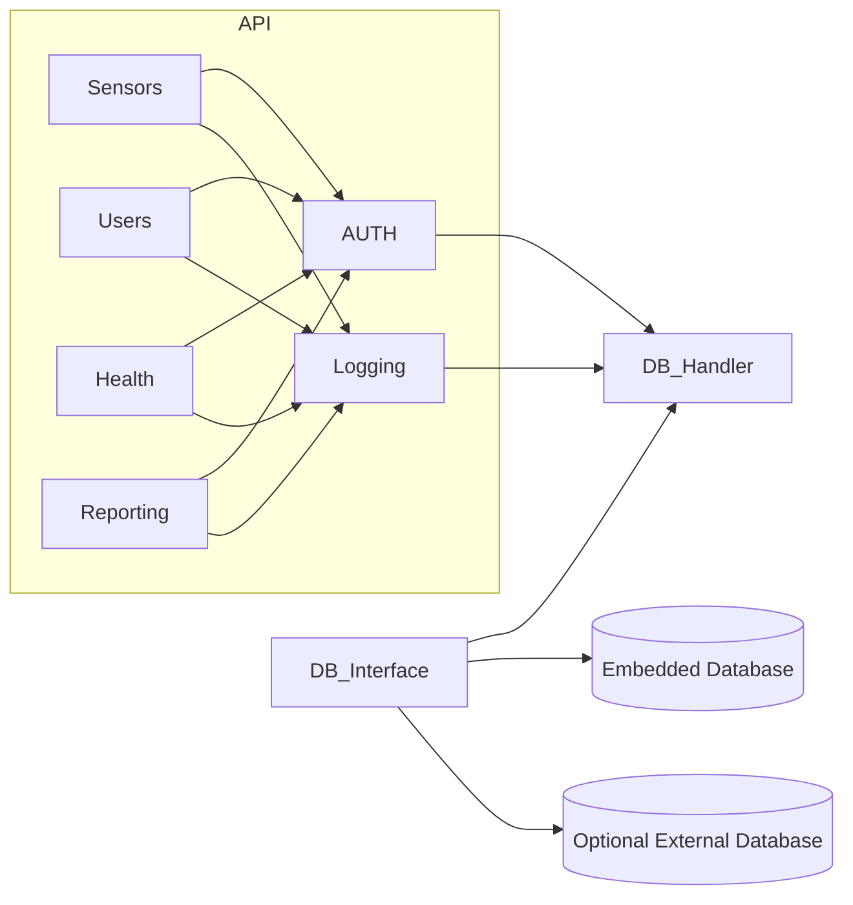

```mermaid 

graph LR;

DB_Interface-->DB_Handler;
DB_Interface-->db1[(Embedded Database)];
DB_Interface-->db2[(Optional External Database)];
DB_Handler;
subgraph API;
Sensors-->AUTH;
Users-->AUTH;
Health-->AUTH;
Reporting-->AUTH;
Sensors-->Logging;
Users-->Logging;
Health-->Logging;
Reporting-->Logging;
end;
AUTH-->DB_Handler;
Logging-->DB_Handler;
```