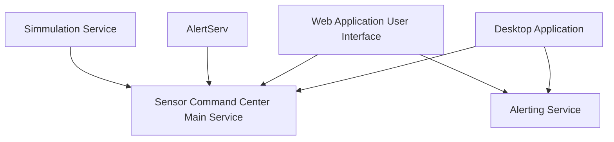

#### Services Flow

```mermaid


flowchart TD


    SimServ[Simmulation Service]

    SCC[Sensor Command Center Main Service]
    AlertServe[Alerting Service]
    
    webUI[Web Application User Interface]
    desktopApp[Desktop Application]

    SimServ --> SCC
    AlertServ --> SCC
    
    webUI --> SCC
    webUI --> AlertServe

    desktopApp --> SCC
    desktopApp --> AlertServe

```
